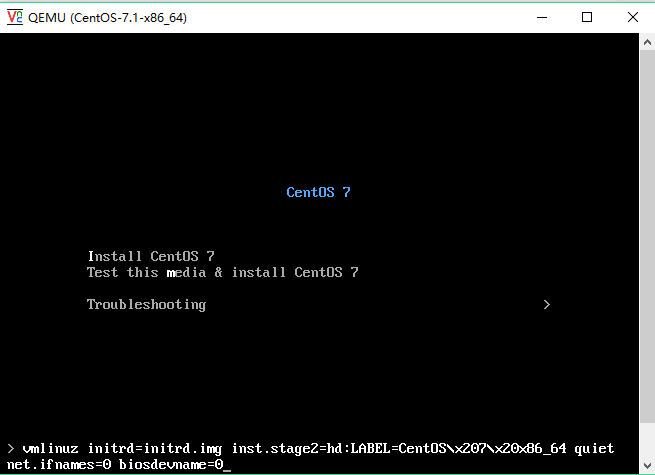
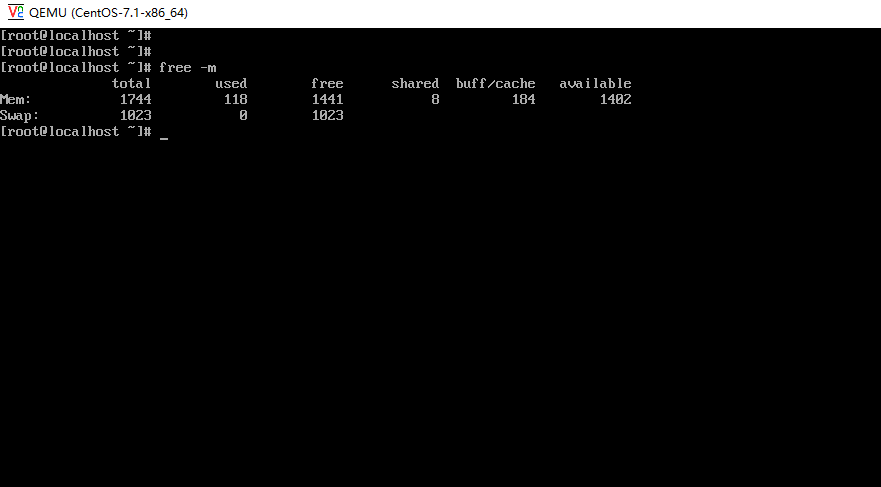

# kvm 在centos系统当中的安装包如下
```shell
[root@linux-node1 ~]# yum -y install qemu-kvm qemu-kvm-tools virt-manager libvirt virt-install
```
<br>


#### kvm 需要CPU中虚拟化功能的支持只能在具有虚拟化支持的CPU上面运行,即具有VT功能的intel cpu具有AMD-V功能的AMD CPU
```shell
[root@linux-node1 ~]# grep -E '(vmx|svm)' /proc/cpuinfo 
flags           : fpu vme de pse tsc msr pae mce cx8 apic sep mtrr pge mca cmov pat pse36 clflush dts mmx fxsr sse sse2 ss syscall nx rdtscp lm constant_tsc arch_perfmon pebs bts nopl xtopology tsc_reliable nonstop_tsc aperfmperf pni pclmulqdq vmx ssse3 cx16 pcid sse4_1 sse4_2 x2apic popcnt tsc_deadline_timer aes xsave avx f16c rdrand hypervisor lahf_lm epb tpr_shadow vnmi ept vpid fsgsbase tsc_adjust smep dtherm ida arat pln pts
```

#### KVM 虚拟化特性 

* 嵌入到Linux正式Kernel（提高兼容性）
* 代码级资源调用（提高性能）
* 虚拟机就是一个进程（内存易于管理）
* 直接支持NUMA拘束（提高扩展性）
* 保持开源发展模式
* 更好的商业支持及服务保障

#### 创建一台虚拟机的命令
```shell
[root@linux-node1 ~]# qemu-img create -f raw /opt/CentOS-7.1-x86_64.raw 10G 
[root@linux-node1 ~]# lsmod | grep kvm
kvm_intel             170086  0 
kvm                   566340  1 kvm_intel
irqbypass              13503  1 kvm

[root@linux-node1 ~]# systemctl restart libvirtd.service
[root@linux-node1 ~]# systemctl status libvirtd.service
● libvirtd.service - Virtualization daemon
   Loaded: loaded (/usr/lib/systemd/system/libvirtd.service; enabled; vendor preset: enabled)
   Active: active (running) since Sun 2018-01-14 13:57:32 CST; 7s ago
	 Docs: man:libvirtd(8)
		   http://libvirt.org
 Main PID: 3462 (libvirtd)
   CGroup: /system.slice/libvirtd.service
		   ├─1703 /usr/sbin/dnsmasq --conf-file=/var/lib/libvirt/dnsmasq/default.conf --leasefile-ro --dhcp-script=/usr/libexec/libvirt_leaseshelper
		   ├─1704 /usr/sbin/dnsmasq --conf-file=/var/lib/libvirt/dnsmasq/default.conf --leasefile-ro --dhcp-script=/usr/libexec/libvirt_leaseshelper
		   └─3462 /usr/sbin/libvirtd

Jan 14 13:57:32 linux-node1.example.com systemd[1]: Starting Virtualization daemon...
Jan 14 13:57:32 linux-node1.example.com systemd[1]: Started Virtualization daemon.
Jan 14 13:57:32 linux-node1.example.com dnsmasq[1703]: read /etc/hosts - 2 addresses
Jan 14 13:57:32 linux-node1.example.com dnsmasq[1703]: read /var/lib/libvirt/dnsmasq/default.addnhosts - 0 addresses
Jan 14 13:57:32 linux-node1.example.com dnsmasq-dhcp[1703]: read /var/lib/libvirt/dnsmasq/default.hostsfile
```


### 克隆镜像命令
   
<br>

```shell
[root@linux-node1 ~]# dd if=/dev/cdrom of=/opt/CentOS-7.1-x86_64.iso
8830976+0 records in
8830976+0 records out
4521459712 bytes (4.5 GB) copied, 682.489 s, 6.6 MB/s
```

### 为创建的虚拟机安装操作系统

<br>

```shell
[root@linux-node1 ~]# virt-install --name CentOS-7.1-x86_64 --virt-type kvm --ram 1024 --cdrom=/opt/CentOS-7.1-x86_64.iso --disk path=/opt/CentOS-7.1-x86_64.raw --network=default --graphics vnc,listen=0.0.0.0 --noautoconsole
Starting install...
Domain installation still in progress. You can reconnect to 
the console to complete the installation process.
[root@linux-node1 ~]# netstat -tunlp | grep qemu
tcp        0      0 0.0.0.0:5900            0.0.0.0:*               LISTEN      4216/qemu-kvm   
```

### 使用vnc远程连接工具进行连接

<br>


#### 由于安装的系统是Centos7的操作系统，新的系统网卡名字是乱序的，所以，这里需要先将该网卡的名称设置成为eth0

	
		
	


#### 查看kvm所启动的进程

<br>

```shell
[root@linux-node1 ~]# ps -ef | grep kvm | grep -v grep 
root        682      2  0 12:10 ?        00:00:00 [kvm-irqfd-clean]
qemu       4216      1 52 14:20 ?        00:12:16 /usr/libexec/qemu-kvm -name CentOS-7.1-x86_64 -S -machine pc-i440fx-rhel7.0.0,accel=kvm,usb=off,dump-guest-core=off -cpu IvyBridge -m 1024 -realtime mlock=off -smp 1,sockets=1,cores=1,threads=1 -uuid 70ad1f0d-96f3-4ea4-a2fe-c3671872dd73 -no-user-config -nodefaults -chardev socket,id=charmonitor,path=/var/lib/libvirt/qemu/domain-1-CentOS-7.1-x86_64/monitor.sock,server,nowait -mon chardev=charmonitor,id=monitor,mode=control -rtc base=utc,driftfix=slew -global kvm-pit.lost_tick_policy=delay -no-hpet -no-reboot -global PIIX4_PM.disable_s3=1 -global PIIX4_PM.disable_s4=1 -boot strict=on -device ich9-usb-ehci1,id=usb,bus=pci.0,addr=0x4.0x7 -device ich9-usb-uhci1,masterbus=usb.0,firstport=0,bus=pci.0,multifunction=on,addr=0x4 -device ich9-usb-uhci2,masterbus=usb.0,firstport=2,bus=pci.0,addr=0x4.0x1 -device ich9-usb-uhci3,masterbus=usb.0,firstport=4,bus=pci.0,addr=0x4.0x2 -device virtio-serial-pci,id=virtio-serial0,bus=pci.0,addr=0x5 -drive file=/opt/CentOS-7.1-x86_64.raw,format=raw,if=none,id=drive-virtio-disk0 -device virtio-blk-pci,scsi=off,bus=pci.0,addr=0x6,drive=drive-virtio-disk0,id=virtio-disk0,bootindex=2 -drive file=/opt/CentOS-7.1-x86_64.iso,format=raw,if=none,id=drive-ide0-0-0,readonly=on -device ide-cd,bus=ide.0,unit=0,drive=drive-ide0-0-0,id=ide0-0-0,bootindex=1 -netdev tap,fd=25,id=hostnet0,vhost=on,vhostfd=27 -device virtio-net-pci,netdev=hostnet0,id=net0,mac=52:54:00:82:6d:ff,bus=pci.0,addr=0x3 -chardev pty,id=charserial0 -device isa-serial,chardev=charserial0,id=serial0 -chardev socket,id=charchannel0,path=/var/lib/libvirt/qemu/channel/target/domain-1-CentOS-7.1-x86_64/org.qemu.guest_agent.0,server,nowait -device virtserialport,bus=virtio-serial0.0,nr=1,chardev=charchannel0,id=channel0,name=org.qemu.guest_agent.0 -device usb-tablet,id=input0,bus=usb.0,port=1 -vnc 0.0.0.0:0 -vga cirrus -device virtio-balloon-pci,id=balloon0,bus=pci.0,addr=0x7 -msg timestamp=on
root       4250      2  0 14:20 ?        00:00:00 [kvm-pit/4216]
```

#### 安装完成之后会自动生成好一个xml文件，这个xml文件就是kvm虚拟机安装的启动文件，如果这个文件丢失，虚拟机就会消失

<br>

```shell
[root@linux-node1 ~]# cd /etc/libvirt/qemu/
[root@linux-node1 qemu]# ls
CentOS-7.1-x86_64.xml  networks
[root@linux-node1 qemu]# cat CentOS-7.1-x86_64.xml 
<!--
WARNING: THIS IS AN AUTO-GENERATED FILE. CHANGES TO IT ARE LIKELY TO BE
OVERWRITTEN AND LOST. Changes to this xml configuration should be made using:
  virsh edit CentOS-7.1-x86_64
or other application using the libvirt API.
-->

<domain type='kvm'>
  <name>CentOS-7.1-x86_64</name>
  <uuid>70ad1f0d-96f3-4ea4-a2fe-c3671872dd73</uuid>
  <memory unit='KiB'>1048576</memory>
  <currentMemory unit='KiB'>1048576</currentMemory>
  <vcpu placement='static'>1</vcpu>
  <os>
	<type arch='x86_64' machine='pc-i440fx-rhel7.0.0'>hvm</type>
	<boot dev='hd'/>
  </os>
  <features>
	<acpi/>
	<apic/>
  </features>
  <cpu mode='custom' match='exact' check='partial'>
	<model fallback='allow'>IvyBridge</model>
  </cpu>
  <clock offset='utc'>
	<timer name='rtc' tickpolicy='catchup'/>
	<timer name='pit' tickpolicy='delay'/>
	<timer name='hpet' present='no'/>
  </clock>
  <on_poweroff>destroy</on_poweroff>
  <on_reboot>restart</on_reboot>
  <on_crash>destroy</on_crash>
  <pm>
	<suspend-to-mem enabled='no'/>
	<suspend-to-disk enabled='no'/>
  </pm>
  <devices>
	<emulator>/usr/libexec/qemu-kvm</emulator>
	<disk type='file' device='disk'>
	  <driver name='qemu' type='raw'/>
	  <source file='/opt/CentOS-7.1-x86_64.raw'/>
	  <target dev='vda' bus='virtio'/>
	  <address type='pci' domain='0x0000' bus='0x00' slot='0x06' function='0x0'/>
	</disk>
	<disk type='file' device='cdrom'>
	  <driver name='qemu' type='raw'/>
	  <target dev='hda' bus='ide'/>
	  <readonly/>
	  <address type='drive' controller='0' bus='0' target='0' unit='0'/>
	</disk>
	<controller type='usb' index='0' model='ich9-ehci1'>
	  <address type='pci' domain='0x0000' bus='0x00' slot='0x04' function='0x7'/>
	</controller>
	<controller type='usb' index='0' model='ich9-uhci1'>
	  <master startport='0'/>
	  <address type='pci' domain='0x0000' bus='0x00' slot='0x04' function='0x0' multifunction='on'/>
	</controller>
	<controller type='usb' index='0' model='ich9-uhci2'>
	  <master startport='2'/>
	  <address type='pci' domain='0x0000' bus='0x00' slot='0x04' function='0x1'/>
	</controller>
	<controller type='usb' index='0' model='ich9-uhci3'>
	  <master startport='4'/>
	  <address type='pci' domain='0x0000' bus='0x00' slot='0x04' function='0x2'/>
	</controller>
	<controller type='pci' index='0' model='pci-root'/>
	<controller type='ide' index='0'>
	  <address type='pci' domain='0x0000' bus='0x00' slot='0x01' function='0x1'/>
	</controller>
	<controller type='virtio-serial' index='0'>
	  <address type='pci' domain='0x0000' bus='0x00' slot='0x05' function='0x0'/>
	</controller>
	<interface type='network'>
	  <mac address='52:54:00:82:6d:ff'/>
	  <source network='default'/>
	  <model type='virtio'/>
	  <address type='pci' domain='0x0000' bus='0x00' slot='0x03' function='0x0'/>
	</interface>
	<serial type='pty'>
	  <target port='0'/>
	</serial>
	<console type='pty'>
	  <target type='serial' port='0'/>
	</console>
	<channel type='unix'>
	  <target type='virtio' name='org.qemu.guest_agent.0'/>
	  <address type='virtio-serial' controller='0' bus='0' port='1'/>
	</channel>
	<input type='tablet' bus='usb'>
	  <address type='usb' bus='0' port='1'/>
	</input>
	<input type='mouse' bus='ps2'/>
	<input type='keyboard' bus='ps2'/>
	<graphics type='vnc' port='-1' autoport='yes' listen='0.0.0.0'>
	  <listen type='address' address='0.0.0.0'/>
	</graphics>
	<video>
	  <model type='cirrus' vram='16384' heads='1' primary='yes'/>
	  <address type='pci' domain='0x0000' bus='0x00' slot='0x02' function='0x0'/>
	</video>
	<memballoon model='virtio'>
	  <address type='pci' domain='0x0000' bus='0x00' slot='0x07' function='0x0'/>
	</memballoon>
  </devices>
</domain>
```

#### 默认安装完成虚拟机之后，虚拟机是关机的状态，所以需要将虚拟机开启
```shell
[root@linux-node1 qemu]# virsh list --all
 Id    Name                           State
----------------------------------------------------
 -     CentOS-7.1-x86_64              shut off
[root@linux-node1 qemu]# 
[root@linux-node1 qemu]# virsh start CentOS-7.1-x86_64
Domain CentOS-7.1-x86_64 started
[root@linux-node1 qemu]# virsh list --all
 Id    Name                           State
----------------------------------------------------
 2     CentOS-7.1-x86_64              running
```
 
#### 该进程会默认为虚拟机dhcp分配ip地址
```shell
[root@linux-node1 qemu]# ps aux | grep dns
nobody     1703  0.0  0.0  15604   928 ?        S    12:11   0:00 /usr/sbin/dnsmasq --conf-file=/var/lib/libvirt/dnsmasq/default.conf --leasefile-ro --dhcp-script=/usr/libexec/libvirt_leaseshelper
root       1704  0.0  0.0  15576   188 ?        S    12:11   0:00 /usr/sbin/dnsmasq --conf-file=/var/lib/libvirt/dnsmasq/default.conf --leasefile-ro --dhcp-script=/usr/libexec/libvirt_leaseshelper
root       5172  0.0  0.0 112660   972 pts/0    R+   15:05   0:00 grep --color=auto dns
```

#### 有些时候我们也可以根据虚拟机的xml配置文件来更改虚拟机的配置,通过命令
```shell
[root@linux-node1 qemu]# virsh list --all
 Id    Name                           State
----------------------------------------------------
 2     CentOS-7.1-x86_64              running
[root@linux-node1 qemu]# virsh edit CentOS-7.1-x86_64
<vcpu placement='auto' current="1">4</vcpu>  # 更改cpu的配置文件

保存退出之后重启虚拟机
[root@linux-node1 qemu]# virsh shutdown CentOS-7.1-x86_64
Domain CentOS-7.1-x86_64 is being shutdown

[root@linux-node1 qemu]# 
[root@linux-node1 qemu]# 
[root@linux-node1 qemu]# virsh list
 Id    Name                           State
----------------------------------------------------

[root@linux-node1 qemu]# virsh list --all
 Id    Name                           State
----------------------------------------------------
 -     CentOS-7.1-x86_64              shut off

[root@linux-node1 qemu]# virsh start CentOS-7.1-x86_64 
Domain CentOS-7.1-x86_64 started

[root@linux-node1 qemu]# 
[root@linux-node1 qemu]# virsh list
 Id    Name                           State
----------------------------------------------------
 3     CentOS-7.1-x86_64              running
```

#### 查看虚拟机的CPU目前之后一个，但是之前更改配置文件的时候设定最大cpu能够拥有4个，所以，这里可以对其进行热添加
	

#### 执行cpcu热添加命令
```shell
[root@linux-node1 qemu]# virsh setvcpus CentOS-7.1-x86_64 2 --live
```

#### 发现cpu已经热添加完毕
	

#### 如果虚拟机没有自动显示出热添加的cpu，可以有如下方法将 /sys/devices/system/cpu/cpuX/online 的值设置成为1, 1就表示启动
	

#### CPU热添加，总数不能超过最大CPU
```shell
[root@linux-node1 qemu]# virsh setvcpus CentOS-7.1-x86_64 2 --live
[root@linux-node1 qemu]# virsh setvcpus CentOS-7.1-x86_64 3 --live
[root@linux-node1 qemu]# virsh setvcpus CentOS-7.1-x86_64 1 --live
```

#### 实时调整虚拟机内存的大小方法，对当前虚拟机的内存进行增加和减少：
```shell
[root@linux-node1 qemu]# virsh list --all  
 Id    Name                           State
----------------------------------------------------
 5     CentOS-7.1-x86_64              running

[root@linux-node1 qemu]# virsh edit  CentOS-7.1-x86_64 
<memory unit='KiB'>4048576</memory>  # 设置该虚拟机最大内存为4G

[root@linux-node1 qemu]# virsh shutdown CentOS-7.1-x86_64
Domain CentOS-7.1-x86_64 is being shutdown

[root@linux-node1 qemu]# virsh list
 Id    Name                           State
----------------------------------------------------

[root@linux-node1 qemu]# virsh list --all
 Id    Name                           State
----------------------------------------------------
 -     CentOS-7.1-x86_64              shut off
 
[root@linux-node1 qemu]# virsh start CentOS-7.1-x86_64 
Domain CentOS-7.1-x86_64 started
```

#### 查看虚拟机当前的内存命令
```shell
[root@linux-node1 qemu]# virsh qemu-monitor-command CentOS-7.1-x86_64 --hmp --cmd info balloon # 当前内存为1G
balloon: actual=1024

[root@linux-node1 qemu]# virsh qemu-monitor-command CentOS-7.1-x86_64 --hmp --cmd balloon 600  # 设置当前内存为600M

[root@linux-node1 qemu]# virsh qemu-monitor-command CentOS-7.1-x86_64 --hmp --cmd info balloon # 查看当前内存
balloon: actual=600

[root@linux-node1 qemu]# virsh qemu-monitor-command CentOS-7.1-x86_64 --hmp --cmd balloon 2048 # 设置当前内存为2G

[root@linux-node1 qemu]# virsh qemu-monitor-command CentOS-7.1-x86_64 --hmp --cmd info balloon # 查看当前内存
balloon: actual=2048
```

#### 在看当前虚拟机的内存状态是否已经被改变
	

#### 设置kvm虚拟机的网桥模式
```shell
brctl show
....

brctl addbr br0
```
