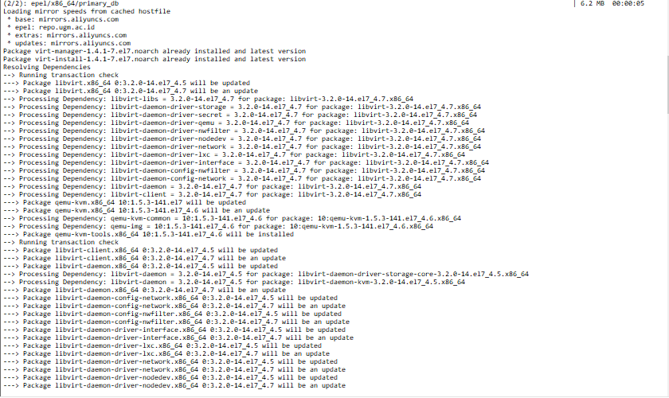
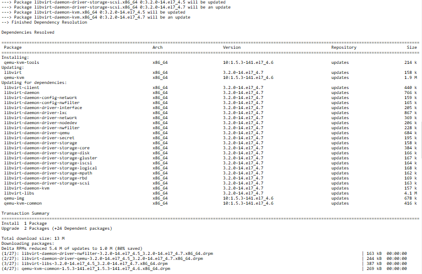
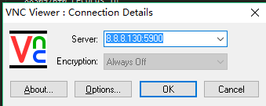
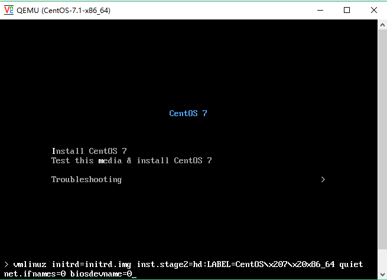
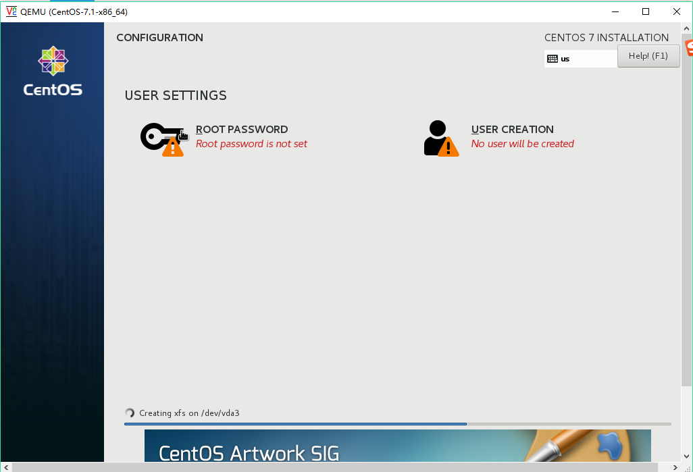
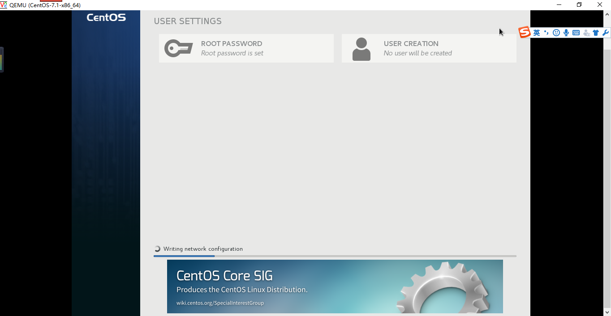
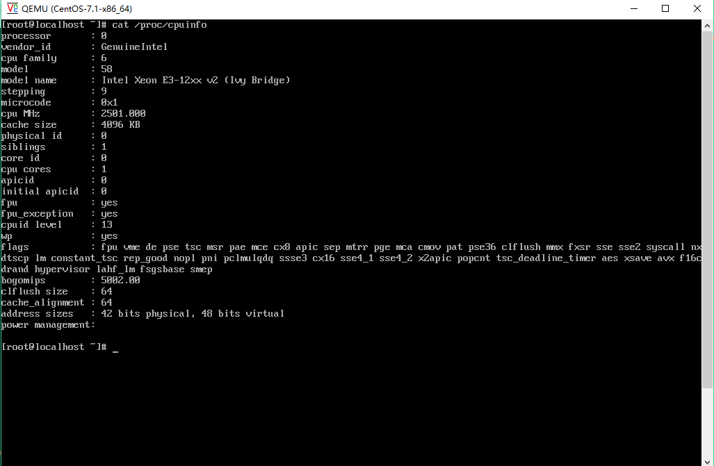
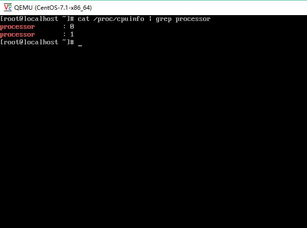
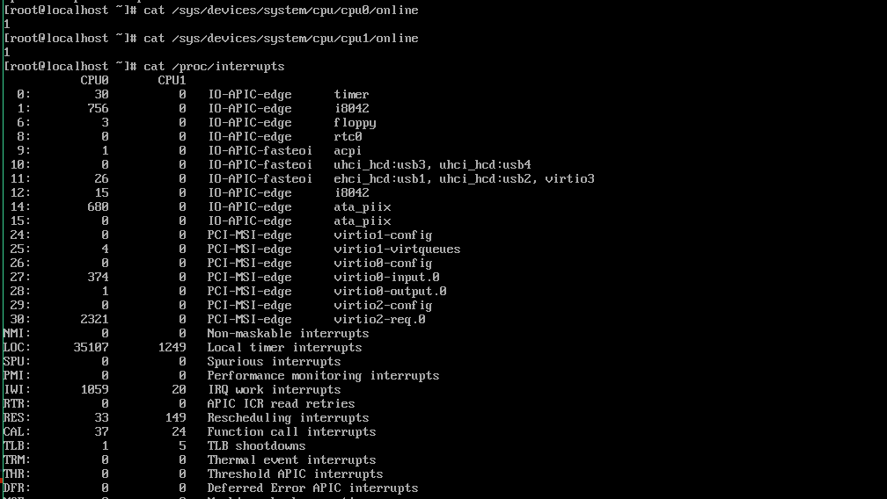
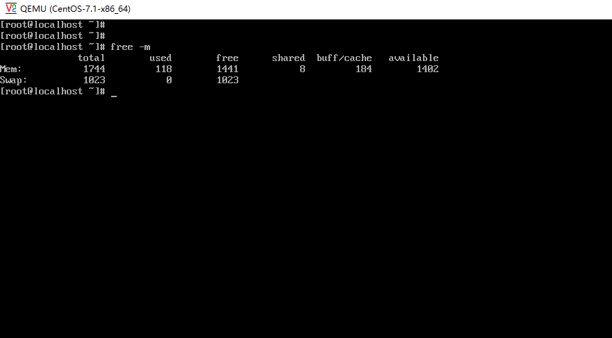

	# kvm 在centos系统当中的安装包如下
	[root@linux-node1 ~]# yum -y install qemu-kvm qemu-kvm-tools virt-manager libvirt virt-install

	# kvm 需要CPU中虚拟化功能的支持只能在具有虚拟化支持的CPU上面运行,即具有VT功能的intel cpu具有AMD-V功能的AMD CPU
	[root@linux-node1 ~]# grep -E '(vmx|svm)' /proc/cpuinfo 
	flags           : fpu vme de pse tsc msr pae mce cx8 apic sep mtrr pge mca cmov pat pse36 clflush dts mmx fxsr sse sse2 ss syscall nx rdtscp lm constant_tsc arch_perfmon pebs bts nopl xtopology tsc_reliable nonstop_tsc aperfmperf pni pclmulqdq vmx ssse3 cx16 pcid sse4_1 sse4_2 x2apic popcnt tsc_deadline_timer aes xsave avx f16c rdrand hypervisor lahf_lm epb tpr_shadow vnmi ept vpid fsgsbase tsc_adjust smep dtherm ida arat pln pts

	
	#### KVM 虚拟化特性 ####
	嵌入到Linux正式Kernel（提高兼容性）
	代码级资源调用（提高性能）
	虚拟机就是一个进程（内存易于管理）
	直接支持NUMA拘束（提高扩展性）
	保持开源发展模式
	更好的商业支持及服务保障

	创建一台虚拟机的命令
	[root@linux-node1 ~]# qemu-img create -f raw /opt/CentOS-7.1-x86_64.raw 10G 

	[root@linux-node1 ~]# lsmod | grep kvm
	kvm_intel             170086  0 
	kvm                   566340  1 kvm_intel
	irqbypass              13503  1 kvm

	[root@linux-node1 ~]# systemctl restart libvirtd.service
	[root@linux-node1 ~]# systemctl status libvirtd.service
	● libvirtd.service - Virtualization daemon
	   Loaded: loaded (/usr/lib/systemd/system/libvirtd.service; enabled; vendor preset: enabled)
	   Active: active (running) since Sun 2018-01-14 13:57:32 CST; 7s ago
	     Docs: man:libvirtd(8)
	           http://libvirt.org
	 Main PID: 3462 (libvirtd)
	   CGroup: /system.slice/libvirtd.service
	           ├─1703 /usr/sbin/dnsmasq --conf-file=/var/lib/libvirt/dnsmasq/default.conf --leasefile-ro --dhcp-script=/usr/libexec/libvirt_leaseshelper
	           ├─1704 /usr/sbin/dnsmasq --conf-file=/var/lib/libvirt/dnsmasq/default.conf --leasefile-ro --dhcp-script=/usr/libexec/libvirt_leaseshelper
	           └─3462 /usr/sbin/libvirtd

	Jan 14 13:57:32 linux-node1.example.com systemd[1]: Starting Virtualization daemon...
	Jan 14 13:57:32 linux-node1.example.com systemd[1]: Started Virtualization daemon.
	Jan 14 13:57:32 linux-node1.example.com dnsmasq[1703]: read /etc/hosts - 2 addresses
	Jan 14 13:57:32 linux-node1.example.com dnsmasq[1703]: read /var/lib/libvirt/dnsmasq/default.addnhosts - 0 addresses
	Jan 14 13:57:32 linux-node1.example.com dnsmasq-dhcp[1703]: read /var/lib/libvirt/dnsmasq/default.hostsfile

	克隆镜像命令
	[root@linux-node1 ~]# dd if=/dev/cdrom of=/opt/CentOS-7.1-x86_64.iso
	8830976+0 records in
	8830976+0 records out
	4521459712 bytes (4.5 GB) copied, 682.489 s, 6.6 MB/s

	为创建的虚拟机安装操作系统
	[root@linux-node1 ~]# virt-install --name CentOS-7.1-x86_64 --virt-type kvm --ram 1024 --cdrom=/opt/CentOS-7.1-x86_64.iso --disk path=/opt/CentOS-7.1-x86_64.raw --network=default --graphics vnc,listen=0.0.0.0 --noautoconsole

	Starting install...
	Domain installation still in progress. You can reconnect to 
	the console to complete the installation process.
	[root@linux-node1 ~]# netstat -tunlp | grep qemu
	tcp        0      0 0.0.0.0:5900            0.0.0.0:*               LISTEN      4216/qemu-kvm   

	# 使用vnc远程连接工具进行连接

	由于安装的系统是Centos7的操作系统，新的系统网卡名字是乱序的，所以，这里需要先将该网卡的名称设置成为eth0
	
		
	

	查看kvm所启动的进程
	[root@linux-node1 ~]# ps -ef | grep kvm | grep -v grep 
	root        682      2  0 12:10 ?        00:00:00 [kvm-irqfd-clean]
	qemu       4216      1 52 14:20 ?        00:12:16 /usr/libexec/qemu-kvm -name CentOS-7.1-x86_64 -S -machine pc-i440fx-rhel7.0.0,accel=kvm,usb=off,dump-guest-core=off -cpu IvyBridge -m 1024 -realtime mlock=off -smp 1,sockets=1,cores=1,threads=1 -uuid 70ad1f0d-96f3-4ea4-a2fe-c3671872dd73 -no-user-config -nodefaults -chardev socket,id=charmonitor,path=/var/lib/libvirt/qemu/domain-1-CentOS-7.1-x86_64/monitor.sock,server,nowait -mon chardev=charmonitor,id=monitor,mode=control -rtc base=utc,driftfix=slew -global kvm-pit.lost_tick_policy=delay -no-hpet -no-reboot -global PIIX4_PM.disable_s3=1 -global PIIX4_PM.disable_s4=1 -boot strict=on -device ich9-usb-ehci1,id=usb,bus=pci.0,addr=0x4.0x7 -device ich9-usb-uhci1,masterbus=usb.0,firstport=0,bus=pci.0,multifunction=on,addr=0x4 -device ich9-usb-uhci2,masterbus=usb.0,firstport=2,bus=pci.0,addr=0x4.0x1 -device ich9-usb-uhci3,masterbus=usb.0,firstport=4,bus=pci.0,addr=0x4.0x2 -device virtio-serial-pci,id=virtio-serial0,bus=pci.0,addr=0x5 -drive file=/opt/CentOS-7.1-x86_64.raw,format=raw,if=none,id=drive-virtio-disk0 -device virtio-blk-pci,scsi=off,bus=pci.0,addr=0x6,drive=drive-virtio-disk0,id=virtio-disk0,bootindex=2 -drive file=/opt/CentOS-7.1-x86_64.iso,format=raw,if=none,id=drive-ide0-0-0,readonly=on -device ide-cd,bus=ide.0,unit=0,drive=drive-ide0-0-0,id=ide0-0-0,bootindex=1 -netdev tap,fd=25,id=hostnet0,vhost=on,vhostfd=27 -device virtio-net-pci,netdev=hostnet0,id=net0,mac=52:54:00:82:6d:ff,bus=pci.0,addr=0x3 -chardev pty,id=charserial0 -device isa-serial,chardev=charserial0,id=serial0 -chardev socket,id=charchannel0,path=/var/lib/libvirt/qemu/channel/target/domain-1-CentOS-7.1-x86_64/org.qemu.guest_agent.0,server,nowait -device virtserialport,bus=virtio-serial0.0,nr=1,chardev=charchannel0,id=channel0,name=org.qemu.guest_agent.0 -device usb-tablet,id=input0,bus=usb.0,port=1 -vnc 0.0.0.0:0 -vga cirrus -device virtio-balloon-pci,id=balloon0,bus=pci.0,addr=0x7 -msg timestamp=on
	root       4250      2  0 14:20 ?        00:00:00 [kvm-pit/4216]

	安装完成之后会自动生成好一个xml文件，这个xml文件就是kvm虚拟机安装的启动文件，如果这个文件丢失，虚拟机就会消失
	[root@linux-node1 ~]# cd /etc/libvirt/qemu/
	[root@linux-node1 qemu]# ls
	CentOS-7.1-x86_64.xml  networks
	[root@linux-node1 qemu]# cat CentOS-7.1-x86_64.xml 
	<!--
	WARNING: THIS IS AN AUTO-GENERATED FILE. CHANGES TO IT ARE LIKELY TO BE
	OVERWRITTEN AND LOST. Changes to this xml configuration should be made using:
	  virsh edit CentOS-7.1-x86_64
	or other application using the libvirt API.
	-->

	<domain type='kvm'>
	  <name>CentOS-7.1-x86_64</name>
	  <uuid>70ad1f0d-96f3-4ea4-a2fe-c3671872dd73</uuid>
	  <memory unit='KiB'>1048576</memory>
	  <currentMemory unit='KiB'>1048576</currentMemory>
	  <vcpu placement='static'>1</vcpu>
	  <os>
	    <type arch='x86_64' machine='pc-i440fx-rhel7.0.0'>hvm</type>
	    <boot dev='hd'/>
	  </os>
	  <features>
	    <acpi/>
	    <apic/>
	  </features>
	  <cpu mode='custom' match='exact' check='partial'>
	    <model fallback='allow'>IvyBridge</model>
	  </cpu>
	  <clock offset='utc'>
	    <timer name='rtc' tickpolicy='catchup'/>
	    <timer name='pit' tickpolicy='delay'/>
	    <timer name='hpet' present='no'/>
	  </clock>
	  <on_poweroff>destroy</on_poweroff>
	  <on_reboot>restart</on_reboot>
	  <on_crash>destroy</on_crash>
	  <pm>
	    <suspend-to-mem enabled='no'/>
	    <suspend-to-disk enabled='no'/>
	  </pm>
	  <devices>
	    <emulator>/usr/libexec/qemu-kvm</emulator>
	    <disk type='file' device='disk'>
	      <driver name='qemu' type='raw'/>
	      <source file='/opt/CentOS-7.1-x86_64.raw'/>
	      <target dev='vda' bus='virtio'/>
	      <address type='pci' domain='0x0000' bus='0x00' slot='0x06' function='0x0'/>
	    </disk>
	    <disk type='file' device='cdrom'>
	      <driver name='qemu' type='raw'/>
	      <target dev='hda' bus='ide'/>
	      <readonly/>
	      <address type='drive' controller='0' bus='0' target='0' unit='0'/>
	    </disk>
	    <controller type='usb' index='0' model='ich9-ehci1'>
	      <address type='pci' domain='0x0000' bus='0x00' slot='0x04' function='0x7'/>
	    </controller>
	    <controller type='usb' index='0' model='ich9-uhci1'>
	      <master startport='0'/>
	      <address type='pci' domain='0x0000' bus='0x00' slot='0x04' function='0x0' multifunction='on'/>
	    </controller>
	    <controller type='usb' index='0' model='ich9-uhci2'>
	      <master startport='2'/>
	      <address type='pci' domain='0x0000' bus='0x00' slot='0x04' function='0x1'/>
	    </controller>
	    <controller type='usb' index='0' model='ich9-uhci3'>
	      <master startport='4'/>
	      <address type='pci' domain='0x0000' bus='0x00' slot='0x04' function='0x2'/>
	    </controller>
	    <controller type='pci' index='0' model='pci-root'/>
	    <controller type='ide' index='0'>
	      <address type='pci' domain='0x0000' bus='0x00' slot='0x01' function='0x1'/>
	    </controller>
	    <controller type='virtio-serial' index='0'>
	      <address type='pci' domain='0x0000' bus='0x00' slot='0x05' function='0x0'/>
	    </controller>
	    <interface type='network'>
	      <mac address='52:54:00:82:6d:ff'/>
	      <source network='default'/>
	      <model type='virtio'/>
	      <address type='pci' domain='0x0000' bus='0x00' slot='0x03' function='0x0'/>
	    </interface>
	    <serial type='pty'>
	      <target port='0'/>
	    </serial>
	    <console type='pty'>
	      <target type='serial' port='0'/>
	    </console>
	    <channel type='unix'>
	      <target type='virtio' name='org.qemu.guest_agent.0'/>
	      <address type='virtio-serial' controller='0' bus='0' port='1'/>
	    </channel>
	    <input type='tablet' bus='usb'>
	      <address type='usb' bus='0' port='1'/>
	    </input>
	    <input type='mouse' bus='ps2'/>
	    <input type='keyboard' bus='ps2'/>
	    <graphics type='vnc' port='-1' autoport='yes' listen='0.0.0.0'>
	      <listen type='address' address='0.0.0.0'/>
	    </graphics>
	    <video>
	      <model type='cirrus' vram='16384' heads='1' primary='yes'/>
	      <address type='pci' domain='0x0000' bus='0x00' slot='0x02' function='0x0'/>
	    </video>
	    <memballoon model='virtio'>
	      <address type='pci' domain='0x0000' bus='0x00' slot='0x07' function='0x0'/>
	    </memballoon>
	  </devices>
	</domain>

	默认安装完成虚拟机之后，虚拟机是关机的状态，所以需要将虚拟机开启
	[root@linux-node1 qemu]# virsh list --all
	 Id    Name                           State
	----------------------------------------------------
	 -     CentOS-7.1-x86_64              shut off

	[root@linux-node1 qemu]# 
	[root@linux-node1 qemu]# virsh start CentOS-7.1-x86_64
	Domain CentOS-7.1-x86_64 started

	[root@linux-node1 qemu]# virsh list --all
	 Id    Name                           State
	----------------------------------------------------
	 2     CentOS-7.1-x86_64              running

	该进程会默认为虚拟机dhcp分配ip地址
	[root@linux-node1 qemu]# ps aux | grep dns
	nobody     1703  0.0  0.0  15604   928 ?        S    12:11   0:00 /usr/sbin/dnsmasq --conf-file=/var/lib/libvirt/dnsmasq/default.conf --leasefile-ro --dhcp-script=/usr/libexec/libvirt_leaseshelper
	root       1704  0.0  0.0  15576   188 ?        S    12:11   0:00 /usr/sbin/dnsmasq --conf-file=/var/lib/libvirt/dnsmasq/default.conf --leasefile-ro --dhcp-script=/usr/libexec/libvirt_leaseshelper
	root       5172  0.0  0.0 112660   972 pts/0    R+   15:05   0:00 grep --color=auto dns

	有些时候我们也可以根据虚拟机的xml配置文件来更改虚拟机的配置,通过命令
	[root@linux-node1 qemu]# virsh list --all
	 Id    Name                           State
	----------------------------------------------------
	 2     CentOS-7.1-x86_64              running

	[root@linux-node1 qemu]# virsh edit CentOS-7.1-x86_64
	<vcpu placement='auto' current="1">4</vcpu>  # 更改cpu的配置文件

	保存退出之后重启虚拟机
	[root@linux-node1 qemu]# virsh shutdown CentOS-7.1-x86_64
	Domain CentOS-7.1-x86_64 is being shutdown

	[root@linux-node1 qemu]# 
	[root@linux-node1 qemu]# 
	[root@linux-node1 qemu]# virsh list
	 Id    Name                           State
	----------------------------------------------------

	[root@linux-node1 qemu]# virsh list --all
	 Id    Name                           State
	----------------------------------------------------
	 -     CentOS-7.1-x86_64              shut off

	[root@linux-node1 qemu]# virsh start CentOS-7.1-x86_64 
	Domain CentOS-7.1-x86_64 started

	[root@linux-node1 qemu]# 
	[root@linux-node1 qemu]# virsh list
	 Id    Name                           State
	----------------------------------------------------
	 3     CentOS-7.1-x86_64              running
	
	查看虚拟机的CPU目前之后一个，但是之前更改配置文件的时候设定最大cpu能够拥有4个，所以，这里可以对其进行热添加
	

	执行cpcu热添加命令
	[root@linux-node1 qemu]# virsh setvcpus CentOS-7.1-x86_64 2 --live
	发现cpu已经热添加完毕
	

	如果虚拟机没有自动显示出热添加的cpu，可以有如下方法将 /sys/devices/system/cpu/cpuX/online 的值设置成为1, 1就表示启动：
	

	[root@linux-node1 qemu]# virsh setvcpus CentOS-7.1-x86_64 2 --live
	[root@linux-node1 qemu]# virsh setvcpus CentOS-7.1-x86_64 3 --live
	[root@linux-node1 qemu]# virsh setvcpus CentOS-7.1-x86_64 1 --live
	CPU热添加，总数不能超过最大CPU

	实时调整虚拟机内存的大小方法，对当前虚拟机的内存进行增加和减少：
	[root@linux-node1 qemu]# virsh list --all  
	 Id    Name                           State
	----------------------------------------------------
	 5     CentOS-7.1-x86_64              running

	[root@linux-node1 qemu]# virsh edit  CentOS-7.1-x86_64 
	<memory unit='KiB'>4048576</memory>  # 设置该虚拟机最大内存为4G

	[root@linux-node1 qemu]# virsh shutdown CentOS-7.1-x86_64
	Domain CentOS-7.1-x86_64 is being shutdown

	[root@linux-node1 qemu]# virsh list
	 Id    Name                           State
	----------------------------------------------------

	[root@linux-node1 qemu]# virsh list --all
	 Id    Name                           State
	----------------------------------------------------
	 -     CentOS-7.1-x86_64              shut off

	[root@linux-node1 qemu]# virsh start CentOS-7.1-x86_64 
	Domain CentOS-7.1-x86_64 started

	查看虚拟机当前的内存命令
	[root@linux-node1 qemu]# virsh qemu-monitor-command CentOS-7.1-x86_64 --hmp --cmd info balloon # 当前内存为1G
	balloon: actual=1024

	[root@linux-node1 qemu]# virsh qemu-monitor-command CentOS-7.1-x86_64 --hmp --cmd balloon 600  # 设置当前内存为600M

	[root@linux-node1 qemu]# virsh qemu-monitor-command CentOS-7.1-x86_64 --hmp --cmd info balloon # 查看当前内存
	balloon: actual=600

	[root@linux-node1 qemu]# virsh qemu-monitor-command CentOS-7.1-x86_64 --hmp --cmd balloon 2048 # 设置当前内存为2G

	[root@linux-node1 qemu]# virsh qemu-monitor-command CentOS-7.1-x86_64 --hmp --cmd info balloon # 查看当前内存
	balloon: actual=2048

	在看当前虚拟机的内存状态是否已经被改变
	

	
	把当前的虚拟机状态设置成为暂停状态：
	[root@linux-node1 qemu]# virsh suspend CentOS-7.1-x86_64

	恢复的命令:
	[root@linux-node1 qemu]# virsh resume CentOS-7.1-x86_64

